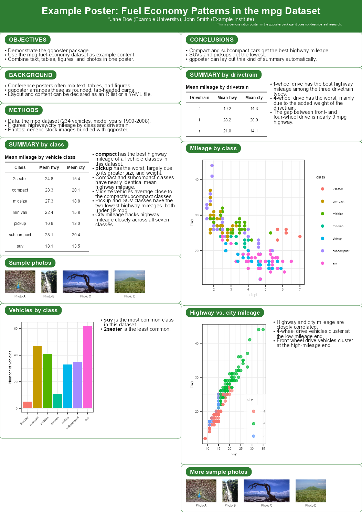
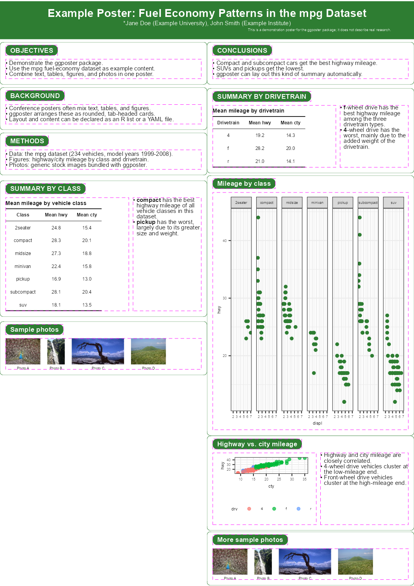

<!-- README.md is generated from README.Rmd. Please edit that file -->

# ggposter

<!-- badges: start -->

<!-- badges: end -->

ggposter builds an A1 (or other true-size) conference poster from
ggplot2. A poster is declared as a title band plus columns of rounded,
tab-headed cards – text, tables, ggplot2 figures, or photo strips –
assembled with
[grid](https://stat.ethz.ch/R-manual/R-devel/library/grid/html/00Index.html)
and [gtable](https://gtable.r-lib.org/) and rendered at true size with
embedded fonts, including CJK (Japanese). Content and layout can be
written as an R list or a YAML file; figures, tables, and photos are
supplied separately as R objects.

## Installation

You can install the development version of ggposter from
[GitHub](https://github.com/) with:

``` r
# install.packages("remotes")
remotes::install_github("matutosi/ggposter")
```

## Example

The layout below follows a typical conference poster – a full-width
title band and a two-column body of rounded, tab-headed cards for
introduction/methods/summary on the left and results/conclusions on the
right – filled in with the `mpg` fuel-economy dataset bundled with
ggplot2. The title, author, and affiliation are placeholders. It also
shows two features for keeping a card’s height tied to what’s actually
in it, instead of a fixed proportion of the column: `height = "auto"`
sizes a card to fit its own content, and `notes` puts a bullet-list
description beside a table or figure.

``` r
library(ggposter)
library(ggplot2)

tbl_class <- aggregate(cbind(hwy, cty) ~ class, data = mpg, FUN = function(x) round(mean(x), 1))
names(tbl_class) <- c("Class", "Mean hwy", "Mean cty")
class_best  <- tbl_class$Class[which.max(tbl_class$`Mean hwy`)]
class_worst <- tbl_class$Class[which.min(tbl_class$`Mean hwy`)]

tbl_drv <- aggregate(cbind(hwy, cty) ~ drv, data = mpg, FUN = function(x) round(mean(x), 1))
names(tbl_drv) <- c("Drivetrain", "Mean hwy", "Mean cty")
drv_best  <- tbl_drv$Drivetrain[which.max(tbl_drv$`Mean hwy`)]
drv_worst <- tbl_drv$Drivetrain[which.min(tbl_drv$`Mean hwy`)]

fig_facet <- ggplot(mpg, aes(displ, hwy)) +
  geom_point(colour = "#2E7D32") +
  facet_wrap(~class, nrow = 1) +
  theme_bw()

fig_scatter <- ggplot(mpg, aes(cty, hwy, colour = drv)) +
  geom_point(alpha = 0.7) +
  theme_bw() +
  theme(legend.position = "bottom")

img_dir <- system.file("extdata", package = "ggposter")
stock_photos <- c("small.JPG", "tall.jpg", "wide.jpg", "large.JPG")
stock_labels <- c("Photo A", "Photo B", "Photo C", "Photo D")

spec <- list(
  title = list(
    title = "Example Poster: Fuel Economy Patterns in the mpg Dataset",
    authors = "*Jane Doe (Example University), John Smith (Example Institute)",
    funding = "This is a demonstration poster for the ggposter package; it does not describe real research."
  ),
  layout = list(
    left  = c("objectives", "background", "methods", "summary_table", "photos_1"),
    right = c("conclusions", "results_table", "fig_facet", "fig_scatter", "photos_2")
  ),
  sections = list(
    objectives = list(header = "OBJECTIVES", height = "auto", body = list(type = "text", md = c(
      "- Demonstrate the ggposter package.",
      "- Use the mpg fuel-economy dataset as example content.",
      "- Combine text, tables, figures, and photos in one poster."
    ))),
    background = list(header = "BACKGROUND", height = "auto", body = list(type = "text", md = c(
      "- Conference posters often mix text, tables, and figures.",
      "- ggposter arranges these as rounded, tab-headed cards.",
      "- Layout and content can be declared as an R list or a YAML file."
    ))),
    methods = list(header = "METHODS", height = "auto", body = list(type = "text", md = c(
      "- Data: the mpg dataset (234 vehicles, model years 1999-2008).",
      "- Figures: highway/city mileage by class and drivetrain.",
      "- Photos: generic stock images bundled with ggposter."
    ))),
    summary_table = list(header = "SUMMARY BY CLASS", height = "auto", body = list(
      type = "table", object = "tbl_class", title = "Mean mileage by vehicle class",
      notes = c(
        sprintf("- **%s** has the best highway mileage of all vehicle classes in this dataset.", class_best),
        sprintf("- **%s** has the worst, largely due to its greater size and weight.", class_worst)
      )
    )),
    photos_1 = list(header = "Sample photos", height = "auto", body = list(
      type = "image", files = stock_photos, labels = stock_labels,
      width = 230
    )),
    conclusions = list(header = "CONCLUSIONS", height = "auto", body = list(type = "text", md = c(
      "- Compact and subcompact cars get the best highway mileage.",
      "- SUVs and pickups get the lowest.",
      "- ggposter can lay out this kind of summary automatically."
    ))),
    results_table = list(header = "SUMMARY BY DRIVETRAIN", height = "auto", body = list(
      type = "table", object = "tbl_drv", title = "Mean mileage by drivetrain",
      notes = c(
        sprintf("- **%s**-wheel drive has the best highway mileage among the three drivetrain types.", drv_best),
        sprintf("- **%s**-wheel drive has the worst, mainly due to the added weight of the drivetrain.", drv_worst)
      )
    )),
    fig_facet = list(header = "Mileage by class", height = 1.3,
      body = list(type = "figure", object = "fig_facet")),
    fig_scatter = list(header = "Highway vs. city mileage", height = "auto", body = list(
      type = "figure", object = "fig_scatter", notes_width = 0.45,
      notes = c(
        "- Highway and city mileage are closely correlated.",
        "- 4-wheel drive vehicles cluster at the low-mileage end.",
        "- Front-wheel drive vehicles cluster at the high-mileage end."
      )
    )),
    photos_2 = list(header = "More sample photos", height = "auto", body = list(
      type = "image", files = stock_photos, labels = stock_labels,
      width = 230
    ))
  )
)

p <- poster(
  spec,
  objects = list(tbl_class = tbl_class, tbl_drv = tbl_drv,
                 fig_facet = fig_facet, fig_scatter = fig_scatter),
  theme = theme_green(base_size = 24),
  base_dir = img_dir
)
```

Rendering a poster at true size makes font sizes and spacing come out
correctly proportioned; previewing it at an arbitrary plot size (as this
README does) does not, so we render a scaled-down preview PNG instead of
printing `p` directly:

``` r
render_poster(p, "man/figures/README-poster-preview.png", scale = 0.3, dpi = 150)

```


### Seeing each card’s plot area

Every card’s header tab and body – the area its text, table, figure, or
photo strip actually occupies – can be outlined with
`show_plot_area = TRUE`. A table/figure paired with a bullet-list
description gets two separate borders, one for each side, rather than
one around the pair. This is useful for checking exactly how much of a
card each of its parts fills, without changing anything about the poster
itself:

``` r
p_plot_area <- poster(
  spec,
  objects = list(tbl_class = tbl_class, tbl_drv = tbl_drv,
                 fig_facet = fig_facet, fig_scatter = fig_scatter),
  theme = theme_green(base_size = 24),
  base_dir = img_dir,
  show_plot_area = TRUE
)
render_poster(p_plot_area, "man/figures/README-poster-preview-plot-area.png", scale = 0.3, dpi = 150)

```


Save it at true size, with fonts embedded:

``` r
render_poster(p, "poster.pdf")                            # true A1 size
render_poster(p, "preview.png", scale = 0.25, dpi = 150)   # A4-ish preview
```

See `vignette("ggposter")` for the full spec schema, theming, and a
reproduction of a real conference poster.
