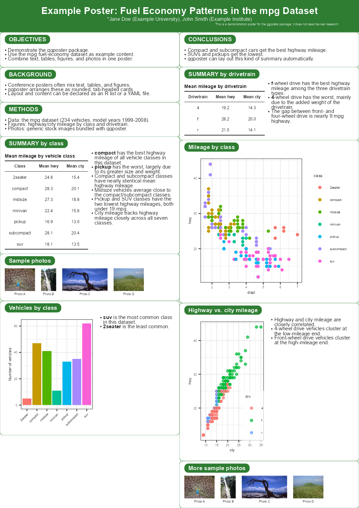
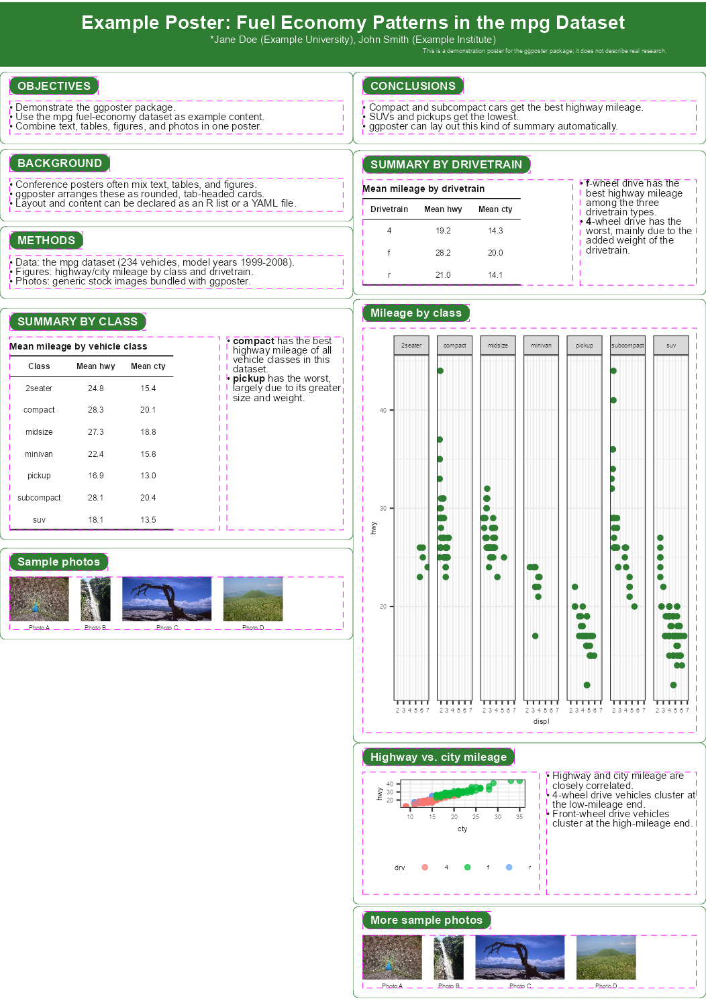
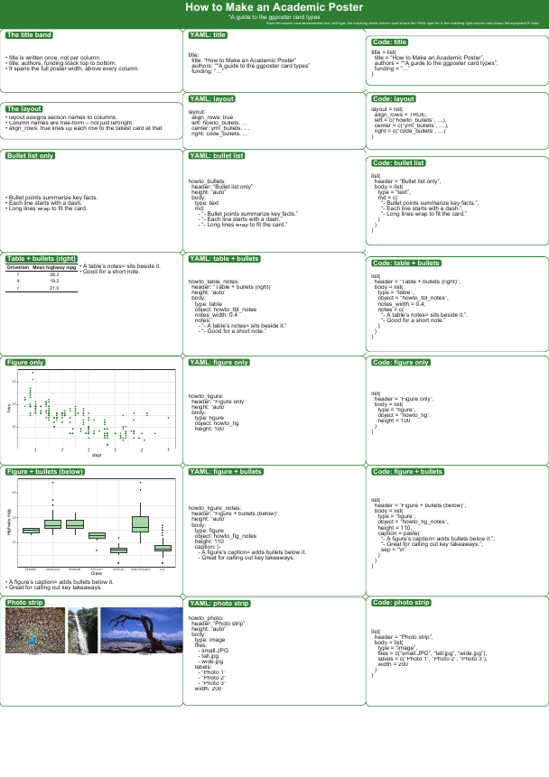
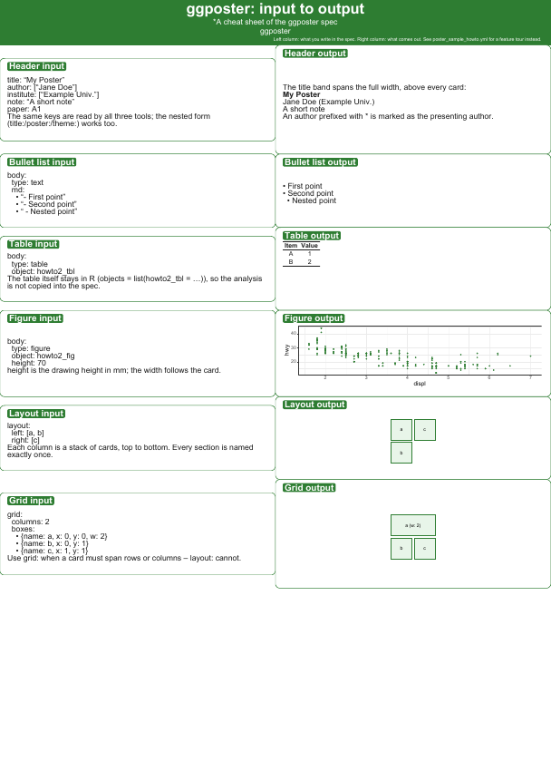
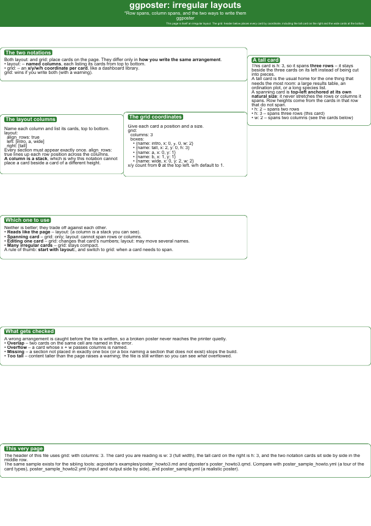
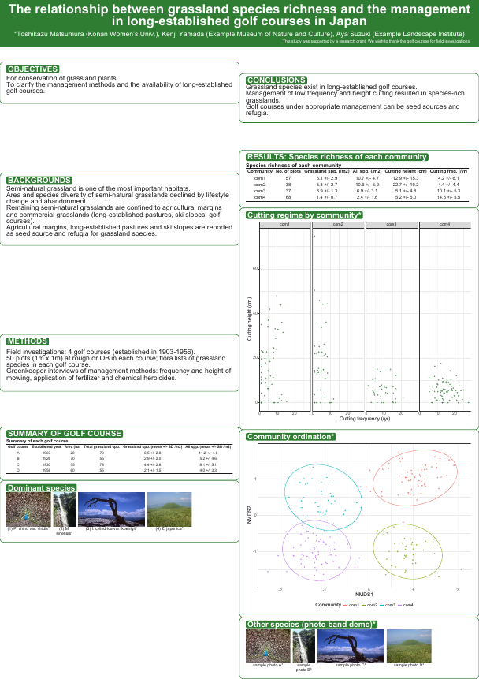

<!-- READMEjp.md is generated from READMEjp.Rmd. Please edit that file -->

# ggposter

<!-- badges: start -->

<!-- badges: end -->

ggposter は，ggplot2 から
A1判(または他の実寸)の学会用ポスターを作成するパッケージだ．
ポスターは，タイトルバンドと，角丸でタブ見出しの付いたカード(テキスト，表，
ggplot2の図，または写真ストリップ)の列として宣言し，
[grid](https://stat.ethz.ch/R-manual/R-devel/library/grid/html/00Index.html)
と[gtable](https://gtable.r-lib.org/)によって組み立てられ，
CJK(日本語を含む)フォントを埋め込んだ実寸で描画される．内容とレイアウトは，
Rのリストまたは YAML ファイルとして記述でき，図・表・写真は別途 R
オブジェクトとして渡す．

ポスターを作るツールは3系統ある (ggposter・
[acposter](https://github.com/matutosi/acposter)・
[qtposter](https://github.com/matutosi/qtposter))．
**互いに置き換えるものではなく，案件ごとに選ぶ**． README
の項目と順序は3つで揃えてある．

## つくれるもの

- **実寸のポスター** — A0/A1/A2 (縦・横)．PDF か PNG で書き出し， CJK
  (日本語) を含めてフォントを埋め込む．
- **表題帯とカード** — 節が1つの角丸・タブ見出しのカードになる．
  カードの中身はテキスト・表・ggplot2 の図・写真の帯で，
  表や図には説明の箇条書きを横 (`notes`) や下 (`caption`) に添えられる．
- **配置の決め方が2通り** — ふつうのポスターは `layout:`
  (名前付きの列)， 行や列をまたぐカードが要るときは `grid:`
  (カードごとの `x`/`y`/`w`/`h`)．
- **宣言的な spec** — 内容と配置は R のリストか YAML．
  図・表・写真は別途 R オブジェクトとして渡すので，**解析は R に残る**．

参考ドキュメント: <https://matutosi.github.io/ggposter/>

## 前提とインストール

開発版の ggposter は，[GitHub](https://github.com/)
から次のようにインストールできる．

``` r
# install.packages("remotes")
remotes::install_github("matutosi/ggposter")
```

ggposter は R で動き，描画に grid/gtable・ggplot2・gridtext を使う．
和文フォントは日本語を組むときだけ要る． **LaTeX もブラウザも要らない**
(R 自身が描く)．

## 使い方

以下のレイアウトは，一般的な学会ポスター(全幅のタイトルバンドと，
左側に紹介・方法・要約，右側に結果・結論を配置した2列構成のカード群)にならい，
ggplot2に同梱されている `mpg` 燃費データセットで内容を埋めたものだ．
タイトル・著者・所属はプレースホルダーである．また，カードの高さを列の固定比率ではなく，
実際の内容に合わせる2つの機能も示している．`height = "auto"`
はカードの高さを その内容に合わせて自動調整し，`notes`
は表や図の横に箇条書きの説明を追加する．

``` r
library(ggposter)

source(system.file("extdata", "readme_example.R", package = "ggposter"))
p <- readme_example_poster()
```

この spec は 140 行ほどあるので，README には置かず
[`inst/extdata/readme_example.R`](inst/extdata/readme_example.R)
にまとめてある (姉妹ツールも見本を別ファイルに置いている)．
`readme_example_spec()` が R のリスト，`readme_example_objects()`
がそれが参照する 図と表，`readme_example_poster()`
が両者を合わせたポスターを返す．

同じレイアウト・テーマ・タイトル・セクション本文は，Rのリストとして
インラインで書く代わりに，YAMLファイルとして持たせることもできる．
宣言的な内容と R コードを分離できる．図と表だけは R 側に残り， `objects`
経由で渡す (上と同じ `readme_example_objects()`)．
仕様内の画像パスは，YAMLファイル自身のディレクトリからの相対パスとして解決される．
以下の `p_yml` は，上の `p` と同一のものである．

``` r
yml_path <- system.file("extdata", "poster_readme_example.yml", package = "ggposter")

p_yml <- poster(yml_path, objects = readme_example_objects())
```

ポスターを実寸で描画すると，フォントサイズや余白のバランスが正しく整うが，
(このREADMEのように)任意のプロットサイズでプレビューするとそうはならないため，
`p` をそのまま出力する代わりに，縮小したプレビューPNGを描画する．

``` r
render_poster(p, "man/figures/README-poster-preview.png", scale = 0.3, dpi = 150)

```


### 各カードのプロット領域を確認する

`render_poster()` に `show_plot_area = TRUE` を渡すと，
各カードのヘッダータブと本体(テキスト・表・図・写真ストリップが実際に占める領域)を，
内容の上から破線の枠で囲んで表示する．表や図に箇条書きの説明が添えられている場合は，
ペア全体を1つの枠で囲むのではなく，それぞれの側に別々の枠が付く．
これは出力時のオプションなので，同じポスター `p` から，上の通常版と，
下の枠付き版の両方を描画できる．各カードのどの部分がどれだけの領域を占めているかを
確認するのに便利である．

``` r
render_poster(p, "man/figures/README-poster-preview-plot-area.png",
              scale = 0.3, dpi = 150, show_plot_area = TRUE)

```


フォントを埋め込んで実寸で保存する:

``` r
render_poster(p, "poster.pdf")                            # 実寸のA1サイズ
render_poster(p, "preview.png", scale = 0.25, dpi = 150)   # A4程度のプレビュー
```

仕様のスキーマ全体・テーマ設定・実際の学会ポスターの再現例については，
`vignette("ggposter")` を参照のこと．

## 書き方の約束

spec は4つの部分からなる．`title` (帯)・`poster` (用紙と向き)・ `theme`
(文字サイズ・書体・差し色)・`sections` (カード)． 各節は
`header`，任意の相対 `height` (`"auto"` なら中身に合わせる)，
そして4種類のいずれかの `body` を持つ．

| `body$type` | 描くもの | 中身の出どころ |
|----|----|----|
| `text` | 段落と箇条書き | `md` (文字列ベクトル) |
| `table` | 表 (横に `notes` を添えられる) | `object` (データフレーム) |
| `figure` | ggplot2 の図 (下に `caption` を添えられる) | `object` (ggplot) |
| `image` | 写真の帯 | `files` (画像のパス) |

メタデータは**平ら**にも書ける (姉妹ツールと同じ書き方．下の
「姉妹ツールとの行き来」を見る)．全体の仕様は `vignette("ggposter")`
にある．

## 配置の決め方

`layout` も `grid` も書かなければ，top-level の `columns` の数で等分し，
節を書いた順に左の列から上へ下へ流し込む．

``` yaml
layout:                        # 名前付きの列．各列は上から下への積み重ね
  align_rows: true
  left:  [objectives, methods]
  right: [results, summary]
```

``` yaml
grid:                          # 座標．0 起点，w/h の既定は 1
  columns: 3
  boxes:
    - {name: objectives, x: 0, y: 0, w: 2}
    - {name: results,    x: 2, y: 0, h: 3}
```

両方書くと `grid` が優先される (警告が出る)． 重なり・`columns`
を超えるはみ出し・1回だけ置かれていない節はエラー，
紙面より高い中身は警告になる． **`grid:`
は3系統とも同じ書式**なので配置ごと移し替えられる． `layout:` は移せない
(ここでは列の名前，acposter では行ごとの行列)．

## 見本

見本を4本同梱している．

|  | 見本 | 内容 |
|----|----|----|
| 1 | [`inst/extdata/poster_sample_howto.yml`](inst/extdata/poster_sample_howto.yml) | カードの種類の一巡り |
| 2 | [`inst/extdata/poster_sample_howto2.yml`](inst/extdata/poster_sample_howto2.yml) | 入力と出力の早見表 |
| 3 | [`inst/extdata/poster_sample_howto3.yml`](inst/extdata/poster_sample_howto3.yml) | 非対称な配置 (`grid:`) |
| 4 | [`inst/extdata/poster_sample.yml`](inst/extdata/poster_sample.yml) | 実際のポスターに近い例 (架空のデータ) |

``` r
source(system.file("extdata", "render_samples.R", package = "ggposter"))
render_ggposter_samples(out_dir = ".")
```

縮小した見本 (画像をクリックすると spec へ)．

| 1\. カードの種類の一巡り | 2\. 入力と出力の早見表 |
|----|----|
| [](inst/extdata/poster_sample_howto.yml) | [](inst/extdata/poster_sample_howto2.yml) |

| 3\. 非対称な配置 (`grid:`) | 4\. 実際のポスターに近い例 |
|----|----|
| [](inst/extdata/poster_sample_howto3.yml) | [](inst/extdata/poster_sample.yml) |

画像は組んだ PDF から
`pdftoppm -r 26 -png <ファイル>.pdf man/figures/README-sampleN` で作る
(acposter・qtposter と同じやり方)．置き場所が `previews/` ではなく
`man/figures/` なのは，**pkgdown
が参照サイトへ複写するのがこのディレクトリだけ**のため．

`poster_sample_flat.yml` (平らなヘッダー) と `poster_readme_example.yml`
も同じ場所にある．

## 姉妹ツールとの行き来

ggposter には，同じ種類のポスターを別の経路で作る姉妹ツールが2つある．
**acposter** (`build-poster-pdf`．Markdown → pandoc → ヘッドレス Chrome)
と **qtposter** (Quarto → Typst) である．
この2つはメタデータを**平らに** (ヘッダーの top-level に) 書くのに対し，
ggposter は `title`/`poster`/`theme` のブロックにまとめる． ggposter
はどちらの形も読み，3つのツールが同じ意味に使っている名前を
対応するブロックへ畳む．そのため**同じヘッダーを3つでそのまま使える**．

``` yaml
title: "One header, three poster tools"
author: ["*A. One", "B. Two"]     # authors, poster-authors
institute: ["Example Univ."]      # institutes, affiliation(s)
note: "Fictional sample."         # funding, footer
paper: A1                         # -> poster$size
orientation: portrait
columns: 2                        # -> 均等割りの layout になる
font-size: 22                     # -> theme$base_size
font: "Noto Sans"                 # -> theme$base_family
type: "学術ポスター"               # acposter だけが要る．ここでは無視される
```

| 意味       | ggposter の正         | 受ける別名                               |
|------------|-----------------------|------------------------------------------|
| 副題       | `title$subtitle`      | `subtitle` (平ら)                        |
| 著者       | `title$authors`       | `author`・`authors`・`poster-authors`    |
| 所属       | `title$affiliations`  | `institute`・`institutes`・`affiliation` |
| 注記       | `title$funding`       | `note`・`funding`・`footer`              |
| ロゴ       | `title$logo`          | `logo` (平ら)                            |
| 用紙       | `poster$size`         | `paper`                                  |
| 向き       | `poster$orientation`  | `orientation` (平ら)                     |
| 段数       | `columns` (top level) | `cols`                                   |
| 文字サイズ | `theme$base_size`     | `font-size`・`font_size`                 |
| 書体       | `theme$base_family`   | `font`・`font-family`・`font_family`     |
| 和文書体   | `theme$cjk_family`    | `cjk-family`                             |
| 差し色     | `theme$accent`        | `accent` (平ら)                          |

top-level の `columns` は，`layout` も `grid` も無いときに `layout`
の代わりになる． 節を書いた順に，左の列を上から埋めて次の列へ流し込む．
`author`・`institute` をリストで書くと，表題帯が描く1行に連結される．
**同じものを二度書いたとき** (キーと別名，あるいは平らな形と入れ子の形)
は， ggposter
側を残して警告する．入れ子の書き方はそのまま動き，混ぜてもよい．

**`size` は受け付けない**．qtposter では文字サイズを指すが，
ここでは用紙を指すため．用紙は `paper`，文字は `font-size` と書く．

[`inst/extdata/poster_sample_flat.yml`](inst/extdata/poster_sample_flat.yml)
が，この書き方で書いたポスター一式である (入れ子の書き方は
`poster_sample.yml`)． 配置については，**`grid:` は ggposter と acposter
で書式が同じ**なのでそのまま移せる． **`layout:` は移せない** —
ここでは列の名前を並べるものだが，acposter では行ごとの行列である．

## 構成

| パス | 中身 |
|----|----|
| `R/` | パッケージ本体 (`poster()`・`render_poster()`・カード・テーマ・YAML の読み込み) |
| `inst/extdata/` | 見本4本と，まとめて組む `render_samples.R` |
| `inst/extdata/readme_example.R` | README の例のポスターの spec とオブジェクト |
| `man/figures/` | README に載せる画像 (見本4本の縮小画像を含む) |
| `vignettes/ggposter.Rmd` | 仕様の全体・テーマ・実際のポスターの再現 |
| `tests/testthat/` | テスト |
| `.github/workflows/` | CI (`R CMD check` (Ubuntu・macOS) と見本4本のビルド) |

## 現状と経緯

ggposter は **R 自身が描く**ので，解析から出てきた図や表をそのまま載せる
ポスターに向く (spec は宣言的なまま，データの処理は R に残る)． 寸法は
mm で指定でき，出力はフォントを埋め込んだ実寸の PDF・PNG になる．

CI は push のたびに `R CMD check` (Ubuntu・macOS)
と見本4本のビルドを回す (`.github/workflows/test.yml`)．pkgdown
のサイトは `main` から配信される．

## ライセンス

**MIT** ([`LICENSE`](LICENSE))．
