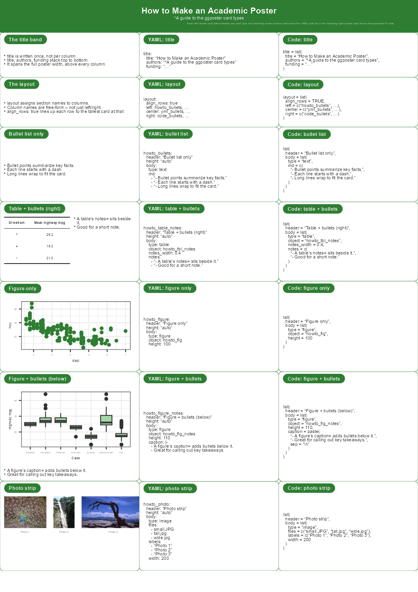

<!-- READMEjp.md is generated from READMEjp.Rmd. Please edit that file -->

# ggposter

<!-- badges: start -->

<!-- badges: end -->

ggposter は，ggplot2 から
A1判(または他の実寸)の学会用ポスターを作成するパッケージだ．
ポスターは，タイトルバンドと，角丸でタブ見出しの付いたカード(テキスト，表，
ggplot2の図，または写真ストリップ)の列として宣言し，
[grid](https://stat.ethz.ch/R-manual/R-devel/library/grid/html/00Index.html)
と[gtable](https://gtable.r-lib.org/)によって組み立てられ，
CJK(日本語を含む)フォントを埋め込んだ実寸で描画される．内容とレイアウトは，
Rのリストまたは YAML ファイルとして記述でき，図・表・写真は別途 R
オブジェクトとして渡す．

## つくれるもの

- **実寸のポスター** — A0/A1/A2 (縦・横)．PDF か PNG で書き出し， CJK
  (日本語) を含めてフォントを埋め込む．
- **表題帯とカード** — 節が1つの角丸・タブ見出しのカードになる．
  カードの中身はテキスト・表・ggplot2 の図・写真の帯で，
  表や図には説明の箇条書きを横 (`notes`) や下 (`caption`) に添えられる．
- **配置の決め方が2通り** — ふつうのポスターは `layout:`
  (名前付きの列)， 行や列をまたぐカードが要るときは `grid:`
  (カードごとの `x`/`y`/`w`/`h`)．
- **宣言的な spec** — 内容と配置は R のリストか YAML．
  図・表・写真は別途 R オブジェクトとして渡すので，**解析は R に残る**．

参考ドキュメント: <https://matutosi.github.io/ggposter/>

## 前提とインストール

開発版の ggposter は，[GitHub](https://github.com/)
から次のようにインストールできる．

``` r
# install.packages("remotes")
remotes::install_github("matutosi/ggposter")
```

ggposter は R で動き，描画に grid/gtable・ggplot2・gridtext を使う．
和文フォントは日本語を組むときだけ要る． **LaTeX もブラウザも要らない**
(R 自身が描く)．

## 使い方

以下のレイアウトは，一般的な学会ポスター(全幅のタイトルバンドと，
左側に紹介・方法・要約，右側に結果・結論を配置した2列構成のカード群)にならい，
ggplot2に同梱されている `mpg` 燃費データセットで内容を埋めたものだ．
タイトル・著者・所属はプレースホルダーである．また，カードの高さを列の固定比率ではなく，
実際の内容に合わせる2つの機能も示している．`height = "auto"`
はカードの高さを その内容に合わせて自動調整し，`notes`
は表や図の横に箇条書きの説明を追加する．

``` r
library(ggposter)
library(ggplot2)

tbl_class <- aggregate(cbind(hwy, cty) ~ class, data = mpg, FUN = function(x) round(mean(x), 1))
names(tbl_class) <- c("Class", "Mean hwy", "Mean cty")
class_best  <- tbl_class$Class[which.max(tbl_class$`Mean hwy`)]
class_worst <- tbl_class$Class[which.min(tbl_class$`Mean hwy`)]

tbl_drv <- aggregate(cbind(hwy, cty) ~ drv, data = mpg, FUN = function(x) round(mean(x), 1))
names(tbl_drv) <- c("Drivetrain", "Mean hwy", "Mean cty")
drv_best  <- tbl_drv$Drivetrain[which.max(tbl_drv$`Mean hwy`)]
drv_worst <- tbl_drv$Drivetrain[which.min(tbl_drv$`Mean hwy`)]

fig_facet <- ggplot(mpg, aes(displ, hwy, colour = class)) +
  geom_point() +
  labs(caption = paste(
    "• Highway mileage falls as engine displacement rises.",
    "• Compact and subcompact classes reach the highest mileage.",
    sep = "\n")) +
  theme_bw() +
  theme(legend.position = "inside", legend.position.inside = c(0.85, 0.72),
        legend.background = element_rect(fill = scales::alpha("white", 0.7), colour = NA),
        legend.key.size = unit(0.9, "lines"),
        plot.caption = element_text(hjust = 0, size = rel(1.3), colour = "black"))

fig_scatter <- ggplot(mpg, aes(cty, hwy, colour = drv)) +
  geom_point(alpha = 0.7) +
  theme_bw() +
  theme(legend.position = "inside", legend.position.inside = c(0.75, 0.32),
        legend.background = element_rect(fill = scales::alpha("white", 0.7), colour = NA))

fig_box <- ggplot(mpg, aes(drv, hwy, fill = drv)) +
  geom_boxplot(show.legend = FALSE) +
  labs(x = "Drivetrain", y = "Highway mpg") +
  theme_bw()
drv_med <- aggregate(hwy ~ drv, data = mpg, FUN = median)
drv_box_best <- as.character(drv_med$drv[which.max(drv_med$hwy)])

mpg_heat <- aggregate(hwy ~ class + drv, data = mpg, FUN = function(x) round(mean(x), 1))
fig_heat <- ggplot(mpg_heat, aes(drv, class, fill = hwy)) +
  geom_tile(colour = "white") +
  geom_text(aes(label = hwy), size = 2.6) +
  scale_fill_gradient(low = "#E8F5E9", high = "#2E7D32") +
  labs(x = "Drivetrain", y = "Class", fill = "Mean hwy") +
  theme_minimal() +
  theme(legend.position = "bottom")

img_dir <- system.file("extdata", package = "ggposter")
stock_photos <- c("small.JPG", "tall.jpg", "wide.jpg", "large.JPG")
stock_labels <- c("Photo A", "Photo B", "Photo C", "Photo D")

spec <- list(
  title = list(
    title = "Example Poster: Fuel Economy Patterns in the mpg Dataset",
    authors = "*Jane Doe (Example University), John Smith (Example Institute)",
    funding = "This is a demonstration poster for the ggposter package; it does not describe real research."
  ),
  layout = list(
    left  = c("objectives", "background", "methods", "summary_table", "fig_box", "fig_heat"),
    right = c("conclusions", "results_table", "fig_facet", "fig_scatter", "photos_2")
  ),
  sections = list(
    objectives = list(header = "OBJECTIVES", height = "auto", body = list(type = "text", md = c(
      "- Demonstrate the ggposter package.",
      "- Use the mpg fuel-economy dataset as example content.",
      "- Combine text, tables, figures, and photos in one poster."
    ))),
    background = list(header = "BACKGROUND", height = "auto", body = list(type = "text", md = c(
      "- Conference posters often mix text, tables, and figures.",
      "- ggposter arranges these as rounded, tab-headed cards.",
      "- Layout and content can be declared as an R list or a YAML file."
    ))),
    methods = list(header = "METHODS", height = "auto", body = list(type = "text", md = c(
      "- Data: the mpg dataset (234 vehicles, model years 1999-2008).",
      "- Figures: highway/city mileage by class and drivetrain.",
      "- Photos: generic stock images bundled with ggposter."
    ))),
    summary_table = list(header = "SUMMARY by class", height = "auto", body = list(
      type = "table", object = "tbl_class", title = "Mean mileage by vehicle class",
      notes = c(
        sprintf("- **%s** has the best highway mileage of all vehicle classes in this dataset.", class_best),
        sprintf("- **%s** has the worst, largely due to its greater size and weight.", class_worst),
        "- Compact and subcompact classes have nearly identical mean highway mileage.",
        "- Midsize vehicles average close to the compact/subcompact classes.",
        "- Pickup and SUV classes have the two lowest highway mileages, both under 19 mpg.",
        "- City mileage tracks highway mileage closely across all seven classes."
      )
    )),
    fig_box = list(header = "Mileage spread by drivetrain", height = "auto", body = list(
      type = "figure", object = "fig_box", notes_width = 0.4, height = 117,
      notes = c(
        "- Boxes show the full spread of highway mileage, not just the mean.",
        sprintf("- **%s**-wheel drive has the highest median highway mileage.", drv_box_best)
      )
    )),
    fig_heat = list(header = "Mean mileage: class x drivetrain", height = "auto", body = list(
      type = "figure", object = "fig_heat", notes_width = 0.4, height = 137,
      notes = c(
        "- Colour shows mean highway mpg for each class/drivetrain combination.",
        "- Blank cells are combinations that don't occur in the data."
      )
    )),
    conclusions = list(header = "CONCLUSIONS", height = "auto", body = list(type = "text", md = c(
      "- Compact and subcompact cars get the best highway mileage.",
      "- SUVs and pickups get the lowest.",
      "- ggposter can lay out this kind of summary automatically."
    ))),
    results_table = list(header = "SUMMARY by drivetrain", height = "auto", body = list(
      type = "table", object = "tbl_drv", title = "Mean mileage by drivetrain",
      notes = c(
        sprintf("- **%s**-wheel drive has the best highway mileage among the three drivetrain types.", drv_best),
        sprintf("- **%s**-wheel drive has the worst, mainly due to the added weight of the drivetrain.", drv_worst),
        "- The gap between front- and four-wheel drive is nearly 9 mpg highway."
      )
    )),
    fig_facet = list(header = "Mileage by class", height = "auto",
      body = list(type = "figure", object = "fig_facet", height = 280)),
    fig_scatter = list(header = "Highway vs. city mileage", height = "auto", body = list(
      type = "figure", object = "fig_scatter", notes_width = 0.45, height = 102,
      notes = c(
        "- Highway and city mileage are closely correlated.",
        "- 4-wheel drive vehicles cluster at the low-mileage end.",
        "- Front-wheel drive vehicles cluster at the high-mileage end."
      )
    )),
    photos_2 = list(header = "More sample photos", height = "auto", body = list(
      type = "image", files = stock_photos, labels = stock_labels,
      width = 230
    ))
  )
)

p <- poster(
  spec,
  objects = list(tbl_class = tbl_class, tbl_drv = tbl_drv,
                 fig_facet = fig_facet, fig_scatter = fig_scatter,
                 fig_box = fig_box, fig_heat = fig_heat),
  theme = theme_green(base_size = 24),
  base_dir = img_dir
)
```

同じレイアウト・テーマ・タイトル・セクション本文は，Rのリストとして
インラインで書く代わりに，YAMLファイルとして持たせることもできる．
宣言的な内容と R コードを分離できる．図と表だけは R 側に残り， `objects`
経由で渡す(上で作成した同じオブジェクトを再利用)．
仕様内の画像パスは，YAMLファイル自身のディレクトリからの相対パスとして解決される．
以下の `p_yml` は，上の `p` と同一のものである．

``` r
yml_path <- system.file("extdata", "poster_readme_example.yml", package = "ggposter")

p_yml <- poster(
  yml_path,
  objects = list(tbl_class = tbl_class, tbl_drv = tbl_drv,
                 fig_facet = fig_facet, fig_scatter = fig_scatter,
                 fig_box = fig_box, fig_heat = fig_heat)
)
```

ポスターを実寸で描画すると，フォントサイズや余白のバランスが正しく整うが，
(このREADMEのように)任意のプロットサイズでプレビューするとそうはならないため，
`p` をそのまま出力する代わりに，縮小したプレビューPNGを描画する．

``` r
render_poster(p, "man/figures/README-poster-preview.png", scale = 0.3, dpi = 150)
knitr::include_graphics("man/figures/README-poster-preview.png")
```


### 各カードのプロット領域を確認する

`render_poster()` に `show_plot_area = TRUE` を渡すと，
各カードのヘッダータブと本体(テキスト・表・図・写真ストリップが実際に占める領域)を，
内容の上から破線の枠で囲んで表示する．表や図に箇条書きの説明が添えられている場合は，
ペア全体を1つの枠で囲むのではなく，それぞれの側に別々の枠が付く．
これは出力時のオプションなので，同じポスター `p` から，上の通常版と，
下の枠付き版の両方を描画できる．各カードのどの部分がどれだけの領域を占めているかを
確認するのに便利である．

``` r
render_poster(p, "man/figures/README-poster-preview-plot-area.png",
              scale = 0.3, dpi = 150, show_plot_area = TRUE)
knitr::include_graphics("man/figures/README-poster-preview-plot-area.png")
```


フォントを埋め込んで実寸で保存する:

``` r
render_poster(p, "poster.pdf")                            # 実寸のA1サイズ
render_poster(p, "preview.png", scale = 0.25, dpi = 150)   # A4程度のプレビュー
```

仕様のスキーマ全体・テーマ設定・実際の学会ポスターの再現例については，
`vignette("ggposter")` を参照のこと．

## 書き方の約束

spec は4つの部分からなる．`title` (帯)・`poster` (用紙と向き)・ `theme`
(文字サイズ・書体・差し色)・`sections` (カード)． 各節は
`header`，任意の相対 `height` (`"auto"` なら中身に合わせる)，
そして4種類のいずれかの `body` を持つ．

| `body$type` | 描くもの | 中身の出どころ |
|----|----|----|
| `text` | 段落と箇条書き | `md` (文字列ベクトル) |
| `table` | 表 (横に `notes` を添えられる) | `object` (データフレーム) |
| `figure` | ggplot2 の図 (下に `caption` を添えられる) | `object` (ggplot) |
| `image` | 写真の帯 | `files` (画像のパス) |

メタデータは**平ら**にも書ける (姉妹ツールと同じ書き方．下の
「姉妹ツールとの行き来」を見る)．全体の仕様は `vignette("ggposter")`
にある．

## 配置の決め方

`layout` も `grid` も書かなければ，top-level の `columns` の数で等分し，
節を書いた順に左の列から上へ下へ流し込む．

``` yaml
layout:                        # 名前付きの列．各列は上から下への積み重ね
  align_rows: true
  left:  [objectives, methods]
  right: [results, summary]
```

``` yaml
grid:                          # 座標．0 起点，w/h の既定は 1
  columns: 3
  boxes:
    - {name: objectives, x: 0, y: 0, w: 2}
    - {name: results,    x: 2, y: 0, h: 3}
```

両方書くと `grid` が優先される (警告が出る)． 重なり・`columns`
を超えるはみ出し・1回だけ置かれていない節はエラー，
紙面より高い中身は警告になる． **`grid:`
は3系統とも同じ書式**なので配置ごと移し替えられる． `layout:` は移せない
(ここでは列の名前，acposter では行ごとの行列)．

## 見本

見本を4本同梱している．acposter・qtposter の4本と1対1で対応しており，
**同じポスターを3つの書き方で書くとこうなる**を見比べられる．

|  | 見本 | 内容 |
|----|----|----|
| 1 | `inst/extdata/poster_sample_howto.yml` | カードの種類の一巡り |
| 2 | `inst/extdata/poster_sample_howto2.yml` | 入力と出力の早見表 |
| 3 | `inst/extdata/poster_sample_howto3.yml` | 非対称な配置 (`grid:`) |
| 4 | `inst/extdata/poster_sample.yml` | 実際のポスターに近い例 (架空のデータ) |

``` r
source(system.file("extdata", "render_samples.R", package = "ggposter"))
render_ggposter_samples(out_dir = ".")
```

`inst/extdata/README.md` に，対応する acposter・qtposter
のファイルを並べた表がある． `poster_sample_flat.yml` (平らなヘッダー)
と `poster_readme_example.yml` も同じ場所にある．

### カードの種類の一巡り

以下のポスターは，実際の研究例ではなく，ggposterのカードタイプを一通り紹介するものだ．
左列には各カードタイプ(はじめに仕様自体の`title`部分と`layout`部分の書き方，
続いて箇条書き，横に`notes`を添えた表，図，図の下にキャプションを添えたもの，
写真ストリップ)が1枚ずつ並び，中央列には左列の各カードに対応するYAML仕様，
右列には対応するRコードが表示される．

``` r
howto_fig <- ggplot(mpg, aes(displ, hwy)) +
  geom_point(colour = "#2E7D32") +
  theme_bw()

howto_fig_notes <- ggplot(mpg, aes(class, hwy)) +
  geom_boxplot(fill = "#A5D6A7") +
  labs(x = "Class", y = "Highway mpg") +
  theme_bw()

howto_tbl_notes <- data.frame(Drivetrain = c("f", "4", "r"),
                               `Mean highway mpg` = c(28.2, 19.2, 21.0),
                               check.names = FALSE)

howto_spec <- list(
  title = list(
    title = "How to Make an Academic Poster",
    authors = "*A guide to the ggposter card types",
    funding = "Each left-column card demonstrates one card type; the matching center-column card shows the YAML spec for it; the matching right-column card shows the equivalent R code."
  ),
  layout = list(
    align_rows = TRUE,
    left   = c(
               "howto_title", "howto_layout",
               "howto_bullets", "howto_table_notes",
               "howto_figure", "howto_figure_notes",
               "howto_photo"),
    center = c(
               "yml_title", "yml_layout",
               "yml_bullets", "yml_table_notes",
               "yml_figure", "yml_figure_notes",
               "yml_photo"),
    right  = c(
               "code_title", "code_layout",
               "code_bullets", "code_table_notes",
               "code_figure", "code_figure_notes",
               "code_photo")
  ),
  sections = list(
    howto_title = list(header = "The title band", height = "auto", body = list(
      type = "text", md = c(
        "- `title` is written once, not per column.",
        "- `title`, `authors`, `funding` stack top to bottom.",
        "- It spans the full poster width, above every column."
      )
    )),
    howto_layout = list(header = "The layout", height = "auto", body = list(
      type = "text", md = c(
        "- `layout` assigns section names to columns.",
        "- Column names are free-form -- not just left/right.",
        "- `align_rows: true` lines up each row to the tallest card at that row."
      )
    )),
    howto_bullets = list(header = "Bullet list only", height = "auto", body = list(
      type = "text", md = c(
        "- Bullet points summarize key facts.",
        "- Each line starts with a dash.",
        "- Long lines wrap to fit the card."
      )
    )),
    howto_figure = list(header = "Figure only", height = "auto", body = list(
      type = "figure", object = "howto_fig", height = 100
    )),
    howto_figure_notes = list(header = "Figure + bullets (below)", height = "auto", body = list(
      type = "figure", object = "howto_fig_notes", height = 110,
      caption = paste(
        "- A figure's caption= adds bullets below it.",
        "- Great for calling out key takeaways.",
        sep = "\n"
      )
    )),
    howto_table_notes = list(header = "Table + bullets (right)", height = "auto", body = list(
      type = "table", object = "howto_tbl_notes", notes_width = 0.4,
      notes = c(
        "- A table's notes= sits beside it.",
        "- Good for a short note."
      )
    )),
    howto_photo = list(header = "Photo strip", height = "auto", body = list(
      type = "image", files = c("small.JPG", "tall.jpg", "wide.jpg"),
      labels = c("Photo 1", "Photo 2", "Photo 3"), width = 200
    )),

    yml_title = list(header = "YAML: title", height = "auto", body = list(
      type = "text", md = c(
        "title:",
        "  title: \"How to Make an Academic Poster\"",
        "  authors: \"*A guide to the ggposter card types\"",
        "  funding: \"...\""
      )
    )),
    yml_layout = list(header = "YAML: layout", height = "auto", body = list(
      type = "text", md = c(
        "layout:",
        "  align_rows: true",
        "  left: howto_bullets, ...",
        "  center: yml_bullets, ...",
        "  right: code_bullets, ..."
      )
    )),
    yml_bullets = list(header = "YAML: bullet list", height = "auto", body = list(
      type = "text", md = c(
        "howto_bullets:",
        "  header: \"Bullet list only\"",
        "  height: \"auto\"",
        "  body:",
        "    type: text",
        "    md:",
        "      \\- \"- Bullet points summarize key facts.\"",
        "      \\- \"- Each line starts with a dash.\"",
        "      \\- \"- Long lines wrap to fit the card.\""
      )
    )),
    yml_figure = list(header = "YAML: figure only", height = "auto", body = list(
      type = "text", md = c(
        "howto_figure:",
        "  header: \"Figure only\"",
        "  height: \"auto\"",
        "  body:",
        "    type: figure",
        "    object: howto_fig",
        "    height: 100"
      )
    )),
    yml_figure_notes = list(header = "YAML: figure + bullets", height = "auto", body = list(
      type = "text", md = c(
        "howto_figure_notes:",
        "  header: \"Figure + bullets (below)\"",
        "  height: \"auto\"",
        "  body:",
        "    type: figure",
        "    object: howto_fig_notes",
        "    height: 110",
        "    caption: |-",
        "      \\- A figure's caption= adds bullets below it.",
        "      \\- Great for calling out key takeaways."
      )
    )),
    yml_table_notes = list(header = "YAML: table + bullets", height = "auto", body = list(
      type = "text", md = c(
        "howto_table_notes:",
        "  header: \"Table + bullets (right)\"",
        "  height: \"auto\"",
        "  body:",
        "    type: table",
        "    object: howto_tbl_notes",
        "    notes_width: 0.4",
        "    notes:",
        "      \\- \"- A table's notes= sits beside it.\"",
        "      \\- \"- Good for a short note.\""
      )
    )),
    yml_photo = list(header = "YAML: photo strip", height = "auto", body = list(
      type = "text", md = c(
        "howto_photo:",
        "  header: \"Photo strip\"",
        "  height: \"auto\"",
        "  body:",
        "    type: image",
        "    files:",
        "      \\- small.JPG",
        "      \\- tall.jpg",
        "      \\- wide.jpg",
        "    labels:",
        "      \\- \"Photo 1\"",
        "      \\- \"Photo 2\"",
        "      \\- \"Photo 3\"",
        "    width: 200"
      )
    )),

    code_title = list(header = "Code: title", height = "auto", body = list(
      type = "text", md = c(
        "title = list(",
        "  title = \"How to Make an Academic Poster\",",
        "  authors = \"*A guide to the ggposter card types\",",
        "  funding = \"...\"",
        ")"
      )
    )),
    code_layout = list(header = "Code: layout", height = "auto", body = list(
      type = "text", md = c(
        "layout = list(",
        "  align_rows = TRUE,",
        "  left   = c(\"howto_bullets\", ...),",
        "  center = c(\"yml_bullets\", ...),",
        "  right  = c(\"code_bullets\", ...)",
        ")"
      )
    )),
    code_bullets = list(header = "Code: bullet list", height = "auto", body = list(
      type = "text", md = c(
        "list(",
        "  header = \"Bullet list only\",",
        "  body = list(",
        "    type = \"text\",",
        "    md = c(",
        "      \"- Bullet points summarize key facts.\",",
        "      \"- Each line starts with a dash.\",",
        "      \"- Long lines wrap to fit the card.\"",
        "    )",
        "  )",
        ")"
      )
    )),
    code_figure = list(header = "Code: figure only", height = "auto", body = list(
      type = "text", md = c(
        "list(",
        "  header = \"Figure only\",",
        "  body = list(",
        "    type = \"figure\",",
        "    object = \"howto_fig\",",
        "    height = 100",
        "  )",
        ")"
      )
    )),
    code_figure_notes = list(header = "Code: figure + bullets", height = "auto", body = list(
      type = "text", md = c(
        "list(",
        "  header = \"Figure + bullets (below)\",",
        "  body = list(",
        "    type = \"figure\",",
        "    object = \"howto_fig_notes\",",
        "    height = 110,",
        "    caption = paste(",
        "      \"- A figure's caption= adds bullets below it.\",",
        "      \"- Great for calling out key takeaways.\",",
        "      sep = \"\\n\"",
        "    )",
        "  )",
        ")"
      )
    )),
    code_table_notes = list(header = "Code: table + bullets", height = "auto", body = list(
      type = "text", md = c(
        "list(",
        "  header = \"Table + bullets (right)\",",
        "  body = list(",
        "    type = \"table\",",
        "    object = \"howto_tbl_notes\",",
        "    notes_width = 0.4,",
        "    notes = c(",
        "      \"- A table's notes= sits beside it.\",",
        "      \"- Good for a short note.\"",
        "    )",
        "  )",
        ")"
      )
    )),
    code_photo = list(header = "Code: photo strip", height = "auto", body = list(
      type = "text", md = c(
        "list(",
        "  header = \"Photo strip\",",
        "  body = list(",
        "    type = \"image\",",
        "    files = c(\"small.JPG\", \"tall.jpg\", \"wide.jpg\"),",
        "    labels = c(\"Photo 1\", \"Photo 2\", \"Photo 3\"),",
        "    width = 200",
        "  )",
        ")"
      )
    ))
  )
)

p_howto <- poster(
  howto_spec,
  objects = list(howto_fig = howto_fig, howto_fig_notes = howto_fig_notes,
                 howto_tbl_notes = howto_tbl_notes),
  theme = theme_green(base_size = 18),
  base_dir = img_dir
)
```

同じレイアウト・テーマ・タイトル・セクション本文は，Rのリストとして
インラインで書く代わりに，YAMLファイルとして持たせることもできる．
図と表だけは R 側に残り，`objects` 経由で渡す． 以下の `p_howto_yml`
は，上の `p_howto` と同一のものである．

``` r
howto_yml_path <- system.file("extdata", "poster_sample_howto.yml", package = "ggposter")

p_howto_yml <- poster(
  howto_yml_path,
  objects = list(howto_fig = howto_fig, howto_fig_notes = howto_fig_notes,
                 howto_tbl_notes = howto_tbl_notes)
)
```

``` r
render_poster(p_howto, "man/figures/README-howto-poster.png", scale = 0.3, dpi = 150)

```


## 姉妹ツールとの行き来

ggposter には，同じ種類のポスターを別の経路で作る姉妹ツールが2つある．
**acposter** (`build-poster-pdf`．Markdown → pandoc → ヘッドレス Chrome)
と **qtposter** (Quarto → Typst) である．
この2つはメタデータを**平らに** (ヘッダーの top-level に) 書くのに対し，
ggposter は `title`/`poster`/`theme` のブロックにまとめる． ggposter
はどちらの形も読み，3つのツールが同じ意味に使っている名前を
対応するブロックへ畳む．そのため**同じヘッダーを3つでそのまま使える**．

``` yaml
title: "One header, three poster tools"
author: ["*A. One", "B. Two"]     # authors, poster-authors
institute: ["Example Univ."]      # institutes, affiliation(s)
note: "Fictional sample."         # funding, footer
paper: A1                         # -> poster$size
orientation: portrait
columns: 2                        # -> 均等割りの layout になる
font-size: 22                     # -> theme$base_size
font: "Noto Sans"                 # -> theme$base_family
type: "学術ポスター"               # acposter だけが要る．ここでは無視される
```

top-level の `columns` は，`layout` も `grid` も無いときに `layout`
の代わりになる． 節を書いた順に，左の列を上から埋めて次の列へ流し込む．
`author`・`institute` をリストで書くと，表題帯が描く1行に連結される．
**同じものを二度書いたとき** (キーと別名，あるいは平らな形と入れ子の形)
は， ggposter
側を残して警告する．入れ子の書き方はそのまま動き，混ぜてもよい．

**`size` は受け付けない**．qtposter では文字サイズを指すが，
ここでは用紙を指すため．用紙は `paper`，文字は `font-size` と書く．

`inst/extdata/poster_sample_flat.yml`
が，この書き方で書いたポスター一式である (入れ子の書き方は
`poster_sample.yml`)． 配置については，**`grid:` は ggposter と acposter
で書式が同じ**なのでそのまま移せる． **`layout:` は移せない** —
ここでは列の名前を並べるものだが，acposter では行ごとの行列である．

## 構成

| パス | 中身 |
|----|----|
| `R/` | パッケージ本体 (`poster()`・`render_poster()`・カード・テーマ・YAML の読み込み) |
| `inst/extdata/` | 見本と，まとめて組む `render_samples.R` |
| `vignettes/ggposter.Rmd` | 仕様の全体・テーマ・実際のポスターの再現 |
| `tests/testthat/` | テスト |

## 現状と経緯

ポスターを作るツールは3系統あり，**互いに置き換えるものではなく案件ごとに選ぶ**．
ggposter は **R オブジェクトをそのまま載せられる**のが持ち味で，
解析から出てきた図や表を並べるポスターに向く． 3つはヘッダーのキー名と
`grid:` の書式を共有し，同じ4本の見本を持つ．

## ライセンス

**MIT** ([`LICENSE`](LICENSE))．3系統 (ggposter・acposter・qtposter)
とも MIT で揃えてある．
